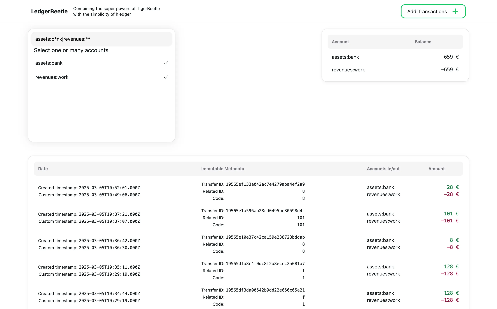

# LedgerBeetle

> Combining the super powers of [TigerBeetle](https://tigerbeetle.com/) with the simplicity of [hledger](https://hledger.org/)

## Screenshots



## Getting started

**Requirements**

- docker
- [just](https://github.com/casey/just)

**Setup**

Remove the tb service if you are running your own or edit the command just like instructed in [Development](#development).

Edit .env, docker-compose.prod.yml with proper database password

**Run**

```
just prod-start
```

## Development

**Requirements**

- rustup, cargo
- postgres-client
- docker
- pnpm
- just

**Setup**

Edit the `docker-compose.prod.yml` under the tb service, follow the changes shown below:

```diff
---# command: format --cluster=0 --replica=0 --replica-count=1 /data/0_0.tigerbeetle
+++command: format --cluster=0 --replica=0 --replica-count=1 /data/0_0.tigerbeetle
---command: start --addresses=0.0.0.0:3001 /data/0_0.tigerbeetle
+++# command: start --addresses=0.0.0.0:3001 /data/0_0.tigerbeetle
```

Then run `docker compose -f docker-compose.dev.yml up tb` then when it is running `ctrl` + `C` and revert the change.

**Run**

For running all processes at the same time run: `make dev`

To run them individually here are the commands:

```
# setup
just dev-docker-start
cd frontend; pnpm i


# then run the following in 2 different terminals
just dev-be-start
just dev-fe-start
```
